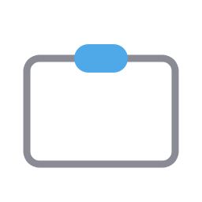
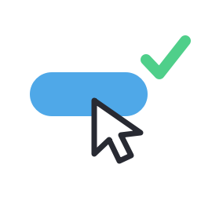
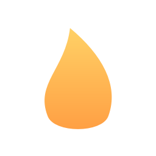
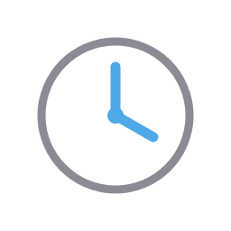

<h1> Sipbar</h1>

**Take a sip, even in the flow**

Windows 桌面的喝水提醒。

工作再忙，也記得喝點水。

[主要功能](#主要功能) • [下載與安裝](#下載與安裝) • [怎麼用](#怎麼用) • [解除安裝](#解除安裝)

---

## 主要功能

<table>
<tr>
<td width="25%" align="center"> 平常完全隱藏，時間到才自己出現</td>
<td width="25%" align="center"> 喝兩口也算，按一下就記錄</td>
<td width="25%" align="center"> 連續天數會累積，沒開電腦不算中斷</td>
<td width="25%" align="center"> 依你的體重與作息自動調整</td>
</tr>
</table>

---

## 系統需求

- Windows 10 或 11
- 不需要另外安裝 Python

---

## 下載與安裝

1. 到 [Releases](https://github.com/weiimg/sipbar/releases/latest) 下載
   `Sipbar-0.9.0-beta-portable.zip`
2. 解壓縮到你喜歡的位置
3. 執行裡面的 `Sipbar.exe`

第一次執行時 Windows 會跳「已保護您的電腦」。點**其他資訊**，再點**仍要執行**。
Windows 對所有沒有數位簽章的程式都會這樣。

---

## 怎麼用

| 動作 | 結果 |
|---|---|
| 滑鼠移到螢幕頂端中央 | 叫它出來，不用等提醒 |
| 左鍵點島 | 記錄補水一次 |
| 滑鼠移到島上 | 展開看完整訊息 |
| 右鍵點島 | 選單：記錄補水、暫停 2 小時、喝水紀錄、設定、結束程式 |
| 系統匣圖示 | 同樣的功能，左鍵補水、右鍵選單 |

五個狀態、資料存在哪、已知限制，見[使用說明](docs/USAGE.md)。

---

## 解除安裝

1. 若開啟過「開機時啟動」，先到設定頁將它關閉
2. 右鍵點系統匣圖示，選擇「結束程式」
3. 刪除解壓縮出來的資料夾
4. 刪除 `%LOCALAPPDATA%\Sipbar\`，設定與紀錄存放於此

第一步必須在刪除程式之前完成。開機自啟寫在 Windows 登錄檔，資料夾刪除後
那一筆仍會留著。若已經刪除，開啟工作管理員的「啟動應用程式」分頁，
將 Sipbar 停用即可。

---

## 授權

程式碼採用 [MIT](LICENSE) 授權。隨附字體不在此範圍內，另依 SIL Open Font
License 1.1 散布，條件與來源見 [assets/fonts](assets/fonts/README.md)。

自行建置、專案結構與設計取捨見[開發說明](docs/DEVELOPMENT.md)。

---

> 我的 side project，跟 Claude 一起寫的。我不是工程師，是接案的影像創作者，
> 做這個是因為我自己需要有東西提醒我喝水，做完覺得堪用就放上來。
