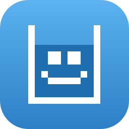
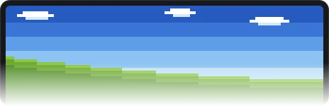

<div align="center">



# Sipbar

**Take a sip, even in the flow**

[](LICENSE)




</div>

工作再忙，也記得喝點水。

Sipbar 平常完全隱藏，螢幕上不佔任何位置。時間到才從頂端滑下來，
點一下就記錄——**不管喝幾口都算**，它不問你喝了多少。

## 安裝

```
git clone https://github.com/weiimg/sipbar.git
cd sipbar
pip install -r requirements.txt
run.bat
```

Windows 10 / 11、Python 3.13。執行只依賴 PySide6。

第一次啟動有三頁引導，全部加起來只問你一個問題。

## 更多

- **[怎麼用](docs/USAGE.md)** — 操作、五個狀態、資料放在哪、已知限制
- **[為什麼這樣做](docs/DESIGN.md)** — 每個決定的理由，以及我判斷錯的地方
- **[MIT](LICENSE)** — 字體另有授權（SIL OFL 1.1），見 [assets/fonts](assets/fonts/README.md)

---

> 我的 side project，跟 Claude 一起寫的。我不是工程師，是接案的影像創作者——
> 做這個是因為我自己需要有東西提醒我喝水，做完覺得堪用就放上來。
