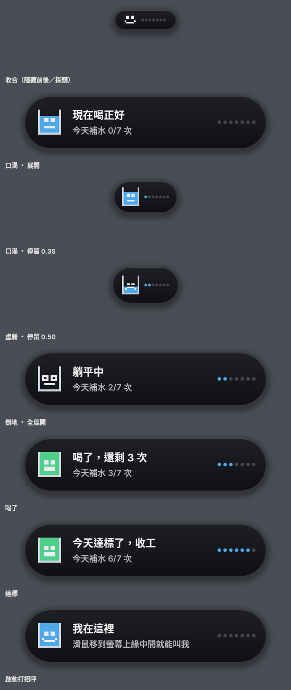
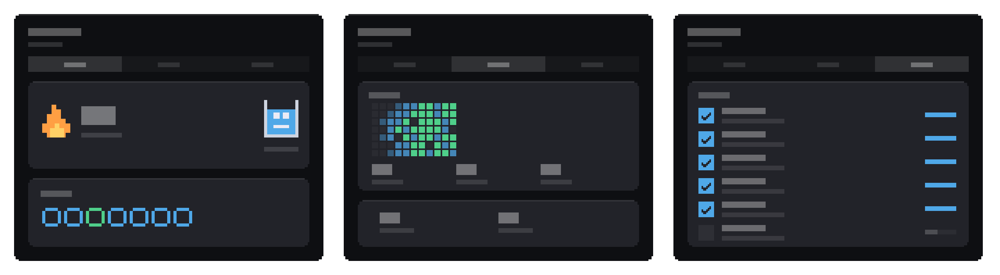

# Sipbar 使用說明

[← 回 README](../README.md)

安裝在 README，設計理由在[設計與決策](DESIGN.md)。這份講的是操作。

## 需求

- Windows 10 / 11
- Python 3.13（開發與實測的版本）

執行只依賴 PySide6。想重建字體或圖示、跑完整測試，另外裝 `pip install -r requirements-dev.txt`。

`run.bat` 走 `pythonw`，不留 console 視窗。要看錯誤訊息就改用 `python src\island.py`。

## 操作

平常它完全隱藏，螢幕上不佔任何位置。時間到才從螢幕頂端滑下來。

- **滑鼠移到螢幕頂端中央** = 島探頭出來（不用等提醒，隨時可以叫它）
- **左鍵點島** = 我剛喝了水（不管喝幾口都算）
- **滑鼠移到島上** = 展開看完整訊息
- **右鍵點島** = 選單：記錄補水 / 暫停提醒 2 小時 / 喝水紀錄 / 設定 / 結束程式
- **系統匣圖示** = 同樣的功能，左鍵補水、右鍵選單

### 啟動時它會自己現身

程式一啟動（含開機自啟）會滑下來 4 秒，告訴你它在哪。一個平常完全隱藏的工具，最大的問題是你不知道它在不在、在哪裡。與其叫你去翻系統匣，不如讓它自己出來打招呼。

### 頂端探頭

把滑鼠移到螢幕上緣中段（中央左右各 `螢幕寬 × 9.3%`、上緣往下 10px 的範圍），
島就會滑下來，滑走就收回去。兩端夾在 140–320px：太窄打不到，太寬會誤觸。

那兩個上下限是**實體像素**，會依你的顯示縮放換算，所以不管你把縮放調到多少，
要跨過的實際距離都一樣。

> 0.10.0-beta 之前這一段在高 DPI 下是壞的：熱區會整個偏離螢幕中央，
> 200% 縮放時照著上面的說明瞄準螢幕上緣正中央，島不會出來。

這條路存在的理由：島隱藏時如果只剩系統匣可以操作，等於把唯一入口交給一個
Windows 預設會摺疊起來的地方。匣圖示還在，但你不需要依賴它。

### 系統匣圖示要找什麼？

它顯示為 `pythonw`。程式是用 Python 執行的，Windows 只認執行檔名稱，所以搜尋「喝水」永遠找不到。

固定到工作列的路徑：

```
設定 → 個人化 → 工作列 → 其他系統匣圖示 → 找到 pythonw → 開啟
```

或是點工作列的「^」，把那顆藍色圓臉圖示拖到工作列上。

匣圖示的顏色就是目前狀態，滑過去會顯示「今天補水 N/7 次」。

### 島上顯示什麼

島上會顯示連續達標天數：探頭時「連續 2 天 · 下次約 95 分後」，提醒時
「連續 2 天 · 今天 0/7 次」，達標當下標題「今天達標了」、小標「連續 3 天」。

## 五個狀態

| 狀態 | 顏色 | 島的行為 | 什麼時候 |
|---|---|---|---|
| 正常 | 藍 | 完全隱藏 | 剛喝完 |
| 口渴 | 黃 | 滑下來展開 6 秒，縮成小藥丸但不消失 | 到間隔時間 |
| 虛弱 | 橘紅 | 展開 8 秒，縮成中等藥丸但不消失 | 忽略 15 分鐘 |
| 倒地 | 灰 | 全展開，不收合也不消失 | 忽略 40 分鐘 |
| 達標 | 綠 | 閃 1.8 秒確認訊息，然後滑走 | 當天補水滿 7 次（預設值，隨體重變） |

沒有關閉按鈕，這是故意的。你趕不走它，只能靠喝水讓它走。消失是獎勵，不是逃生出口。



## 喝水紀錄

右鍵點島選「喝水紀錄」，或從系統匣圖示的選單進入。三個分頁：今天的進度與
本週圓環、累積紀錄與熱圖、成就。



## 為什麼單位是「次」不是「杯」

你的杯子 500cc，但被提醒時你只會喝個幾口，不會把 500cc 灌完。如果計數單位是「杯」，
你只有兩條路：虛報，或是因為「才喝兩口不好意思按」而不按。前者讓數字造假，
後者讓島一直掛在那邊、你開始無視它。兩條都是死路。

所以單位是「補水次數」：點下去只宣稱「我喝了水」，不宣稱喝了多少。
沒有誇大的成分，就沒有虛報的心理壓力。

cc 只在選單和統計裡顯示，而且標明是估算（預設一次抓 200cc，跟目標推算用的同一個值）。
那是參考值，不是紀錄。

## 資料放哪

`%LOCALAPPDATA%\Sipbar\`

- `config.json`：設定。從程式旁邊搬過來的：打包成 exe 裝進 Program Files 之後
  那個目錄不可寫，寫入會靜默失敗（改了設定、沒有錯誤、重開全部復原）。
  舊檔會自動搬過來一次，原檔留著當備份。
- `state.json`：當天次數、累積的在電腦前時間、本輪間隔、暫停狀態、最後存檔時間
- `events.jsonl`：事件紀錄，回應率就是從這裡算的

要重來用設定頁底部的「清除紀錄」（設定會留著），或把整個資料夾刪掉。

**資料不出這台電腦。** 程式不蒐集也不傳送任何東西，上面三個檔就是全部。
唯一一個會連外的動作是引導裡的彩蛋（見[設計與決策的「彩蛋」](DESIGN.md#彩蛋)），
而那是使用者自己按下去的。

> 改名前叫 `WaterPet`，資料夾與自啟登錄值都用過舊名。`settings.py` 的
> `OLD_APP_NAME` 留著不是為了相容，是為了搬：`_migrate_data_dir()` 與
> `_migrate_autostart()` 各在還沒搬過時做一次，搬完就只剩一個名字。
> 不搬的話，舊使用者的紀錄會留在舊資料夾裡變孤兒，而且沒有任何錯誤訊息。

## 開機自啟

在設定頁用「開機時啟動」開關控制。它寫的是登錄檔：

```
HKCU\Software\Microsoft\Windows\CurrentVersion\Run\Sipbar
```

用登錄檔而不是 Startup 資料夾的捷徑，因為工作管理員的「啟動應用程式」分頁
看得到也關得掉。Startup 資料夾裡的捷徑反而是使用者找不到的那一種。

## 已知限制（不修）

全螢幕遊戲、全螢幕影片預覽時，always-on-top 視窗會被 Windows 蓋掉。
那些情境本來就不該打斷，不做 hack 去繞。

收合時島佔螢幕頂端中央 144px 寬，會擋掉最大化視窗標題列那一段的拖曳。
但它只在你該喝水時才出現，平常完全不在。

**在程式執行中更改顯示縮放，島的位置與大小不會跟上，重開程式就正常。**
Windows 的顯示設定自己也寫著「某些應用程式將不會回應縮放比例變更，直到您
關閉並重新開啟它們」。筆電接上或拔掉不同縮放的外接螢幕也是同一條路。
理由與試過的三種修法記在 `src/island.py` 的 `_reposition()`。

## 退場

**14 天檢核點：2026-08-24。**

沒在用就把 Startup 捷徑和整個資料夾刪掉，不要留成背景殭屍程式。
自我追蹤工具最常見的結局不是失敗，是「靜音但沒解除安裝」，然後在系統裡躺半年。
